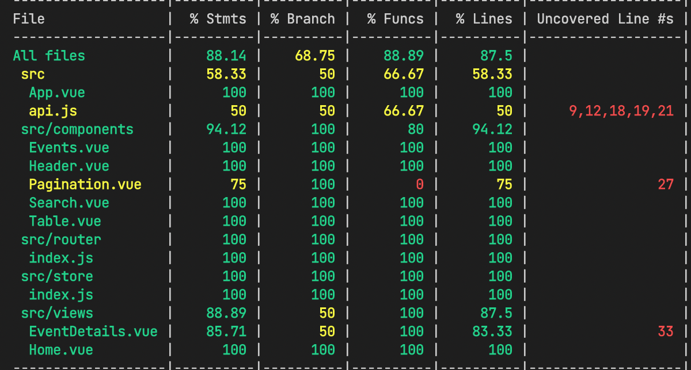

# Tarfin Project

---

<br />

***Tarfin Search Project***
---


***Test Coverage***
---



<br />

## **TITLES**

---

* [Structure of Folders](#structure-of-folders)
* [Description](#description)
* [How to Use the Project](#how-to-use-the-project)
* [Technologies](#technologies)
* [Setup](#setup)
* [Sources](#sources)
  <br />

## Structure of folders

---

- src
    - views
        - [Home.vue](./src/views/Home.vue)
        - [EventDetails.vue](./src/views/EventDetails.vue)
    - components
        -   [Events.vue](./src/components/Events.vue)
        -   [Header.vue](./src/components/Header.vue)
        -   [Pagination.vue](./src/components/Pagination.vue)
        -   [Search.vue](./src/components/Search.vue)
        -   [Table.vue](./src/components/Table.vue)
    - [App.vue](./src/App.vue)
    - [main.js](./src/main.js)
    - [api.js](./src/api.js) 
    - store
        - [Store](./src/store/index.js)
    - router
        - [Router](./src/router/index.js)
- tests
    - unit
        - [AppTest](./tests/unit/app.spec.js)
        - [EventDetailsTest](./tests/unit/eventDetails.spec.js)
        - [EventsTest](./tests/unit/events.spec.js)
        - [HomeTest](./tests/unit/home.spec.js)
        - [PaginationTest](./tests/unit/pagination.spec.js)
        - [SearchTest](./tests/unit/home.spec.js)
        - [TableTest](./tests/unit/table.spec.js)
          <br />


## Description

---

    This is a search project where you can search using a public API.

This project is coded with TDD.

**TDD** or **Test Driven Development** is our biggest helper in not spending hours looking for errors.
It also prevents us from writing extra code by saying "maybe we need it later", we only write what we need when we need it (**KISS (Keep It Simple Stupid)**)
This minimizes cost and complexity. I used **Jest** for tests.
Jest is a testing framework that allows running tests in parallel,
it has strong mocking and allows for isolated testing and it easily runs tests without any config settings.

In this project I used an excellent framework that I have used before; **Vue**. Vue is a lightweight, simple, easy-to-use framework.
Let's go deeper; Vue uses a virtual DOM that is a copy of the original DOM, and it doesn't update the DOM again on every change.
It only updates what has been changed. So it's pretty fast. And Vue supports two-way binding. This speeds up the data update.
Vue allows us to create dynamic web pages by allowing us to develop single page applications.
That's enough to mention, you can read the documentations to learn about its many more benefits.

I also enjoyed using **Vuex**, which is an open-source library.
Because it has a very easy use in the management of states.
Easy access to a state that every component can change it completely eliminates complexity.
It is not easy to transfer state from one component to another and from it to another.
But with Vuex this is very easy. For this reason, I used Vuex in my project.

  <br />

## How to Use the Project

---

You can type the search keyword you want to search in the input on the screen and you can see the search results in the table below. It's that simple.
<br/>

## Technologies

---

* **HTML**
* **CSS**
* **Javascript**
* **Vue**
* **Vuex**
* **Jest**
* **Axios**

<br />

## Setup

---

Setup, install and run project

### Build Setup

``` bash
# install dependencies
npm run install

# serve with hot reload at localhost:3000
npm run dev

# build for production with minification
npm run build

# run all tests (units)
npm run unit:test


```

or use yarn

``` bash
# install dependencies
yarn install

# serve with hot reload at localhost:3000
yarn dev

# build for production with minification
yarn build

# run all tests (units)
yarn unit:test

```
<br />


## Sources

---

https://v3.vuejs.org/

https://stackoverflow.com/questions/

https://vuex.vuejs.org/

https://jestjs.io/

https://v1.test-utils.vuejs.org/


